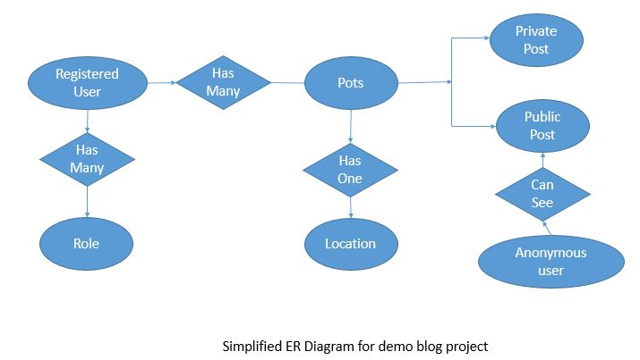

# blog-demo
It is a simple application built with spring boot and Thymeleaf. 
Here user can see the public post of Other user.
The register user can post new posts. Post can be marked as private so that other user will 
not be able to see it.  

## Some of the tools/components I used on this project
- [x] Intellij IDE
- [x] MySQL
- [x] Maven
- [x] Java 1.8
- [x] JPA / Hibernate
- [x] Spring Boot
- [x] Spring MVC
- [x] Spring Security
- [x] JQuery
- [x] Thymeleaf
- [x] Bootstrap 4

## Setup Database Settings
   - Create a database name: blog_db
   - username: root
   - password: root
## Note: Database Credentials can be changed in application.properties file

## Running the application locally

There are several ways to run a Spring Boot application on your local machine. One way is to execute the `main` method in the `Application` class from your IDE.

Alternatively you can use the [Spring Boot Maven plugin](https://docs.spring.io/spring-boot/docs/current/reference/html/build-tool-plugins-maven-plugin.html) like so:

```shell
mvn spring-boot:run
```
## Project ER Diagram

